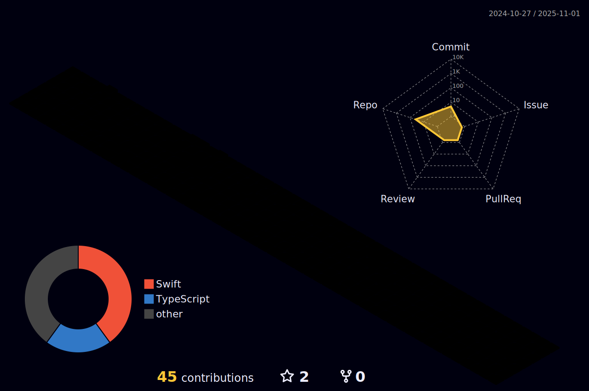

  

|**_Lifelong Learner_**|**_Deep thinker_**|**_Creative Mind_**|**_Child Heart_**|
|-|-|-|-|

<h3>

  
⚡️Git Stats:

  

&nbsp;

  
  

  

  

</h3>

<h3>

  
🔥Langs Stats:

   

  
   
   
  
🧑🏻‍💻Cooking Time:

  

  </h3>
  

IDE:

|||
|-|-|

